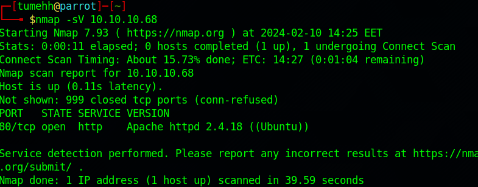
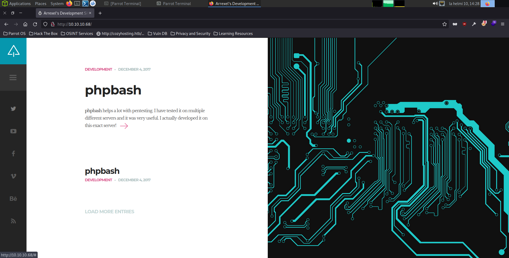
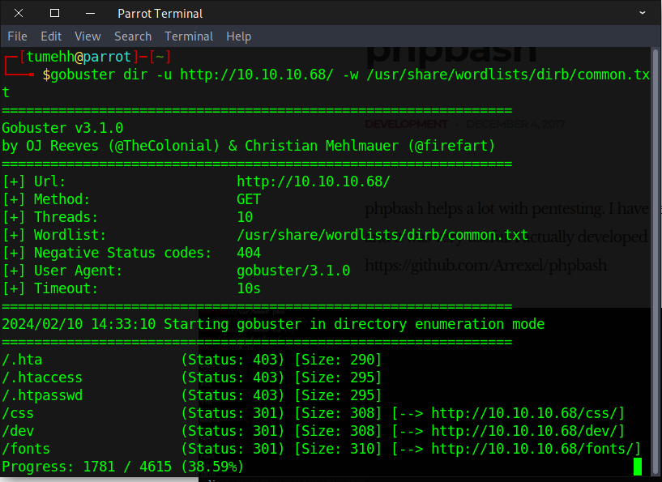
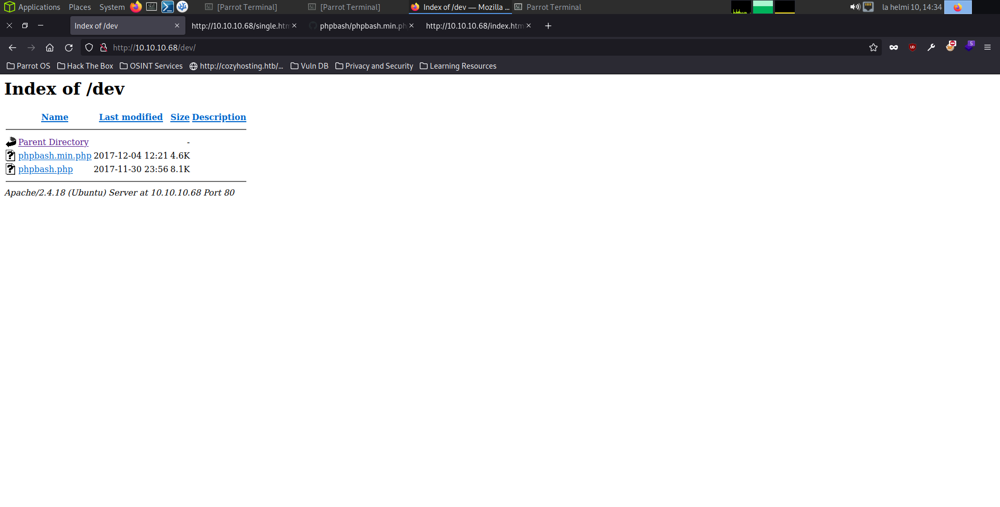
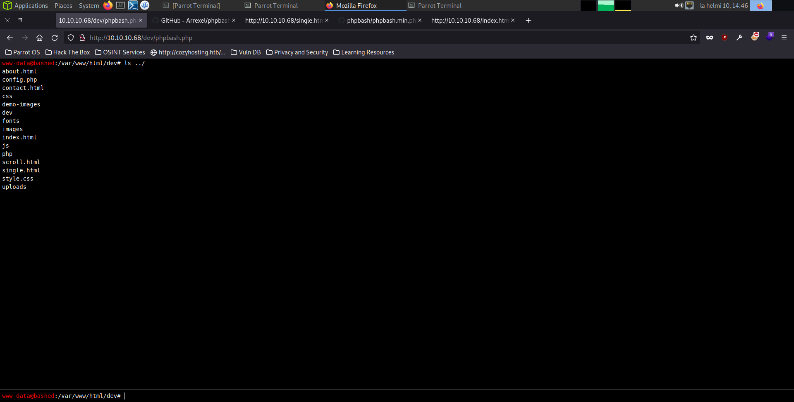

# Bashed

#### _February 10th, 2024_

#### Difficulty: Easy

---
 

I started working on this machine with a quick nmap scan. The scan revealed 1 http port.

Next, I visited the website. It seems like a blog of some kind. The post on the front page talks about a tool called "phpbash" which is used to open a web shell. There is also a github link associated with the blog post to take a look at the tool.

The blog post also states that the tool is developed on "this exact server"...This made me think that there might be something interesting to be found in the indexes and I decided to run a gobuster scan.

The scan revealed some directories, including /dev which caught my eye. Traversing to that directory I found exactly what I thought: phpbash.php.

Using the tool I was able to access the target machine as www-data user. 

