# Blocky
#### _August 13th 2024_

#### Difficulty: Easy

---
 
I started the lab by going to http://blocky.htb. The web server seems to be running a wordpress blog about a Minecraft server.   

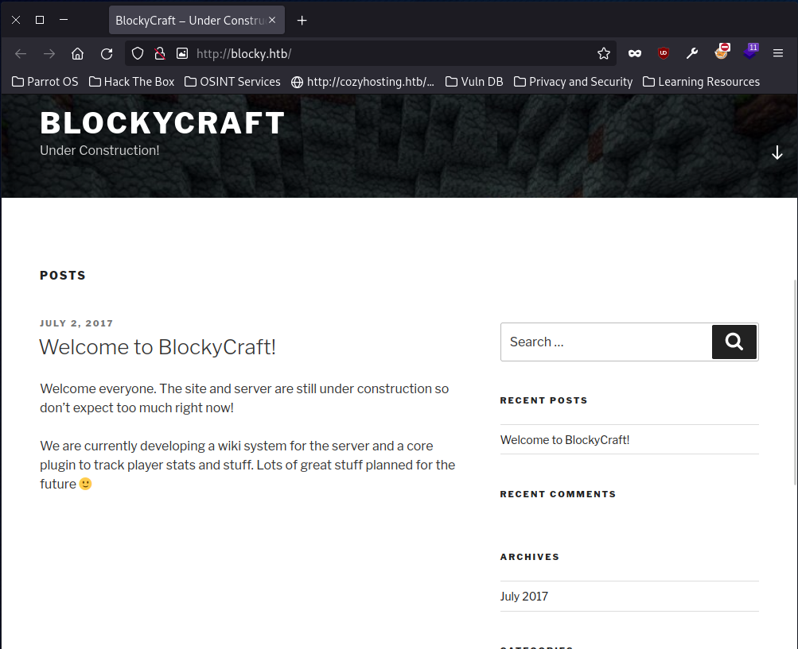
  
After initially looking around the website I decided to run a gobust scan to find any hidden directories on the webserver. From the results I picked two interesting directories: phpmyadmin and plugins.
  
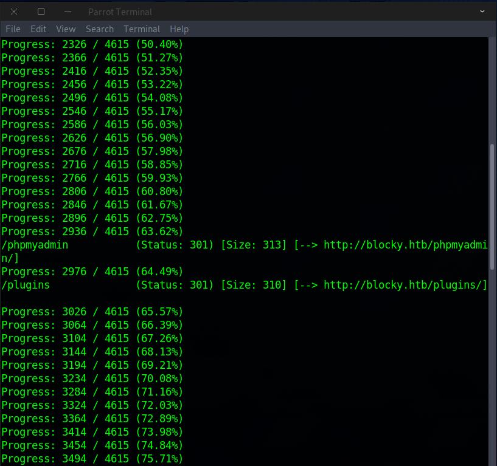
  
The phpmyadmin site had a log in page as expected, but the plugins directory had something more interesting, two downloadable jar files.
  
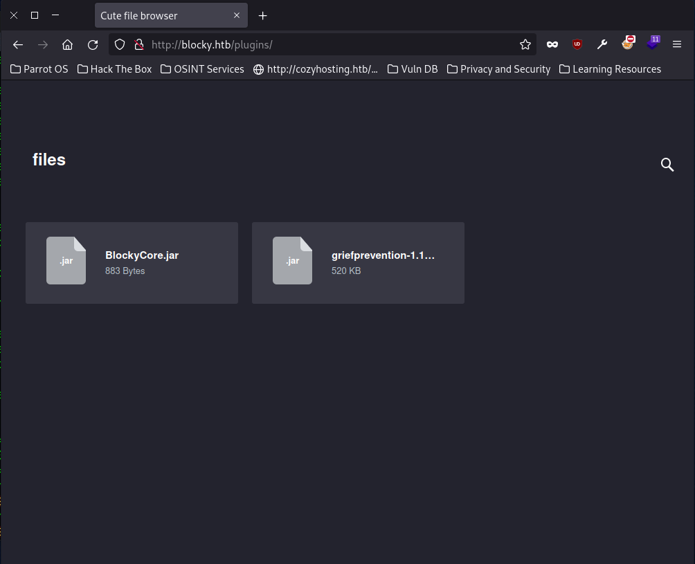
  
 Next, I downloaded the jar files and opened the class files on a IDE. Blockycore.class revealed some credentials:
  
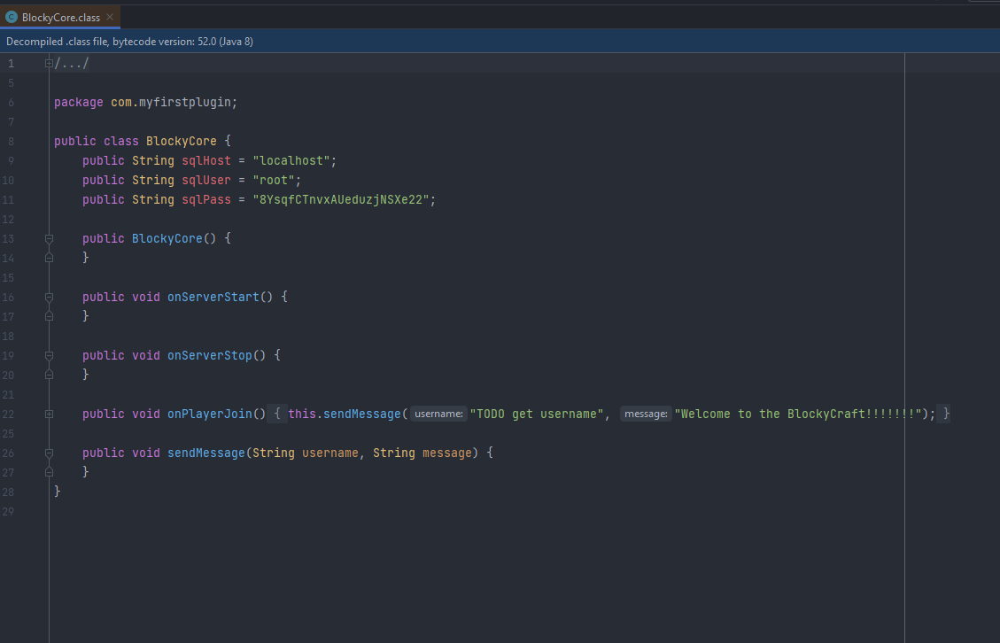
  

Using the credentials above, I was able to log in to the phpmyadmin site that was found earlier on!

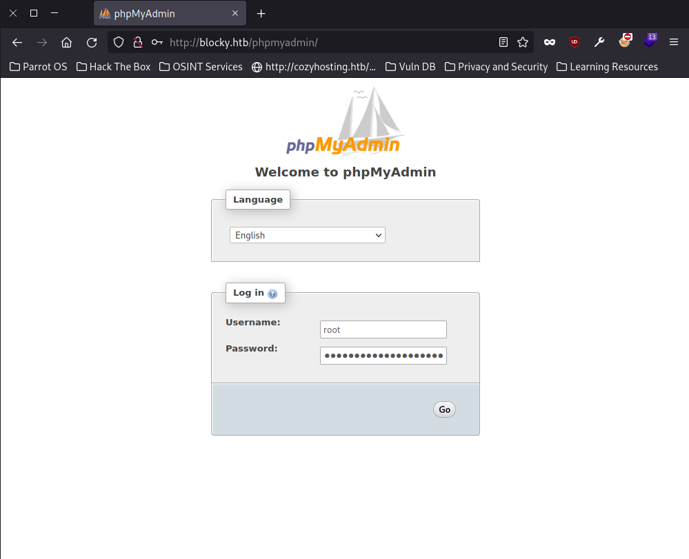
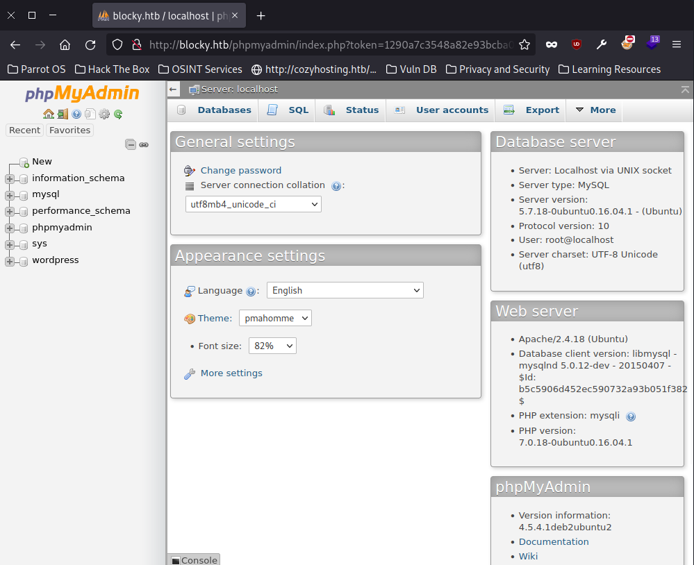
  

Next I took a look around the databases. I found a database called wordpress with a table called wp_users. Inside wp_users there was one user Notch, which I assume is used to log into the wp admin dashboard.
  
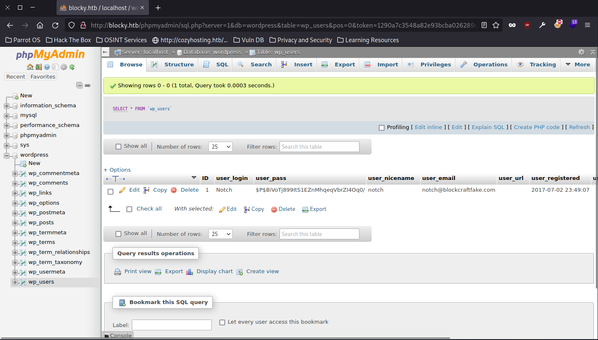
  
Next step took me a second to understand. I tried to change the password of the user Notch, but the password I changed it into did not work. After a google search I realised that the password needs to be encrypted for it to work. To do this, action MD5 needs to be selected when changing the password.
  
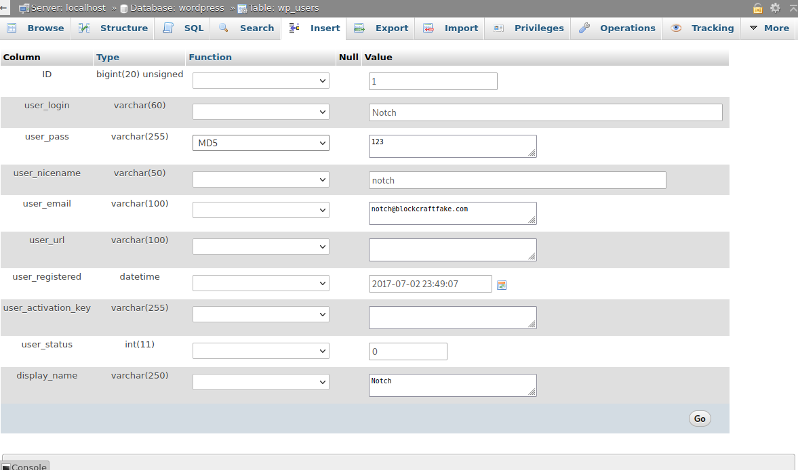
  
Next, I traversed to the wordpress login site and entered the credentials. I managed to log in to the admin dashboard.
  
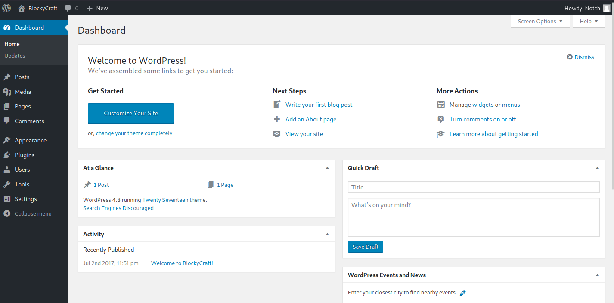
  
After looking around on the admin dashboard I found the plugins. Two plugins were present, "Hello Dolly" and "Akismet Anti-Spam". "Hello Dolly" seems to be some sort of word generator that fires when logging in to the admin dashboard. I figured that perhaps I could add malicious code to the plugin and make it run by logging to the admin dashboard. I decided to go with a simple forward shell:
  
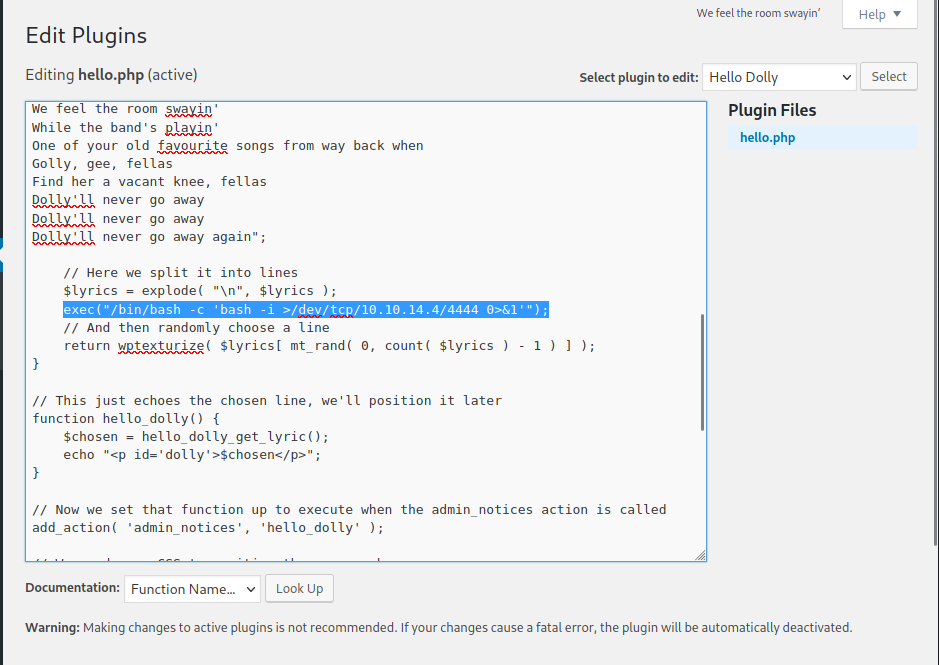
  
I activated the plugin, started a listener on my machine and relogged into the admin dashboard. I was in on the target machine:
  
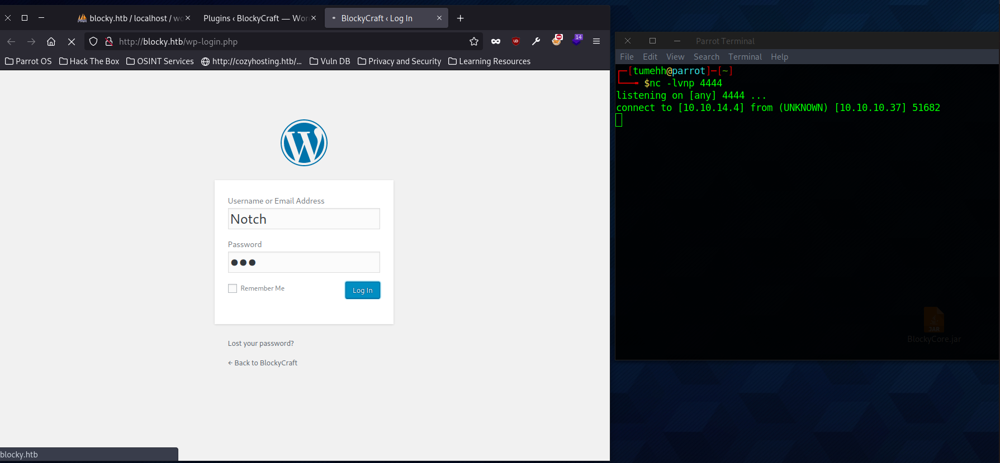
  
Next, I spent quite a while enumerating the target machine. The user on this machine is called notch, and I was supposed to find a way to get on that user. After bunch of deadends I decided to simply try and ssh to the user using the same password as phpmyadmin had. To my surprise, it worked and I got in.
  
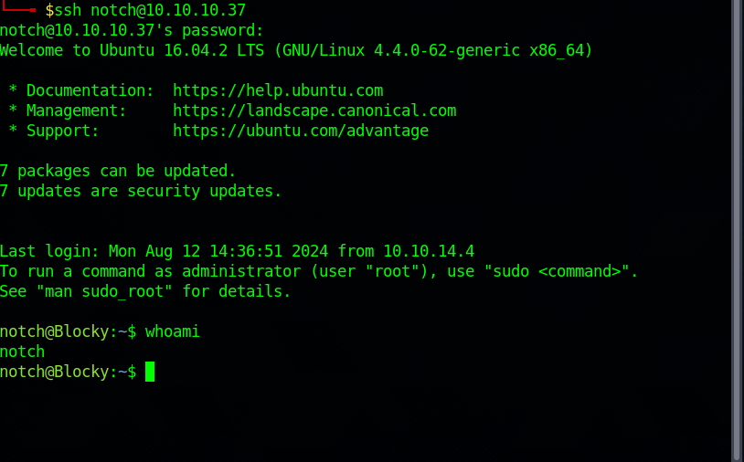
  
Next, with slightly elevated privileges it was time to enumerate the machine even further. I ran a linpeas script, which didn't reveal too much. Checking crontab however, I found something interesting; on reboot, the machine runs a start.sh script from the users home directory:
  
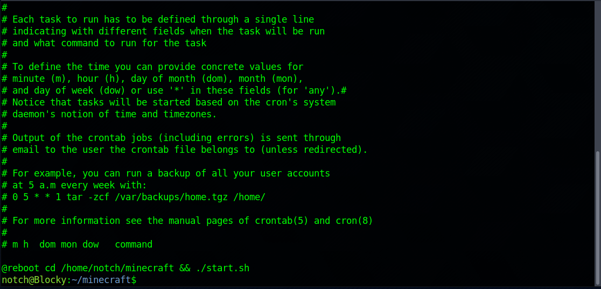
  
I took a look inside the start script and it seems to be just a simple script to run the minecraft server on reboot. The script gave me a hint though and the "screen" program caught my eye. 
  
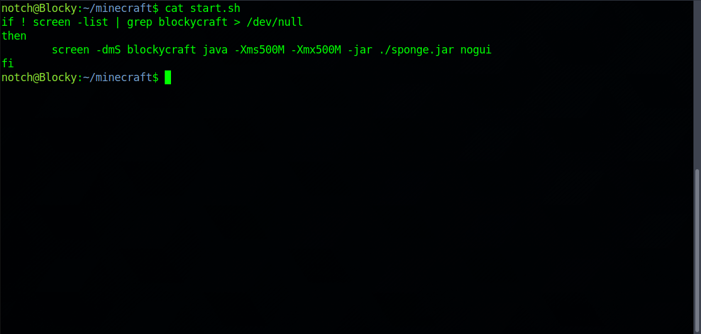
  
I decided to look into "screen" and <a href="https://gtfobins.github.io/">GTFOBins</a> revealed that if the binary is allowed to run as superuser, it does not drop the elevated privileges. This means that I should simply be able to run "sudo screen" to start a new terminal as superuser...I gave it a try, and it worked. I am root!
  
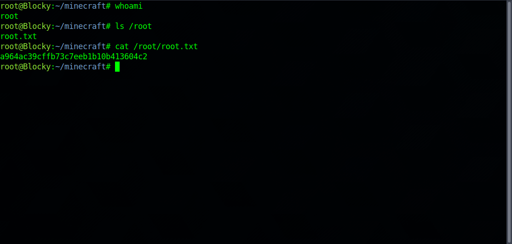
  