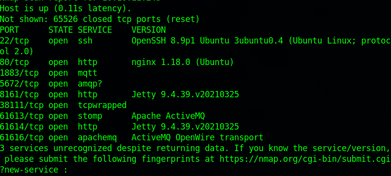
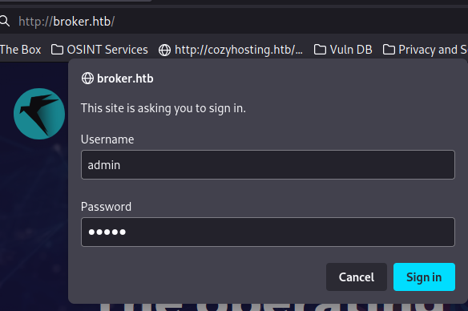
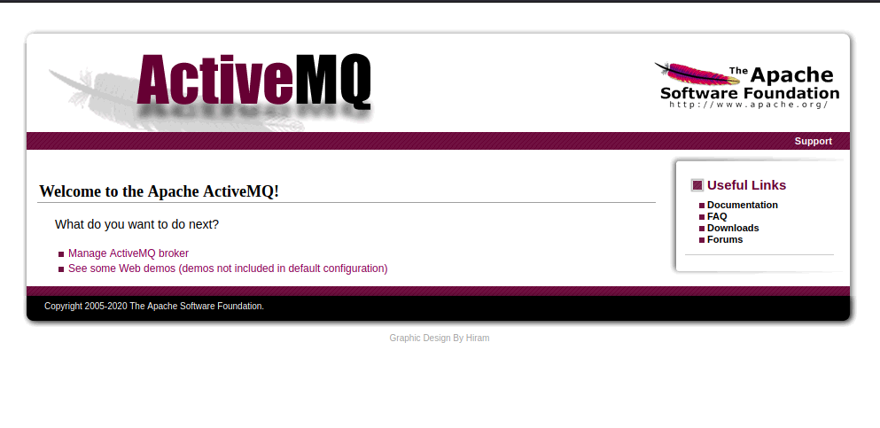
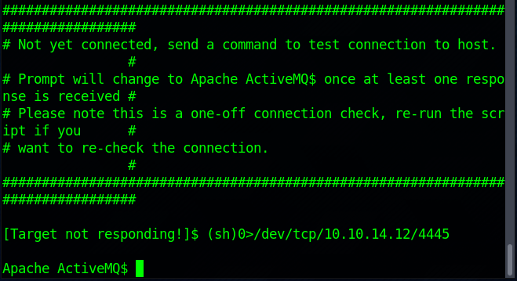
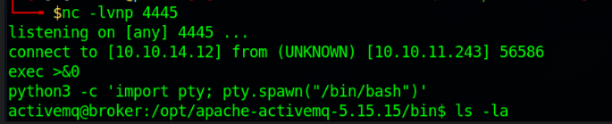
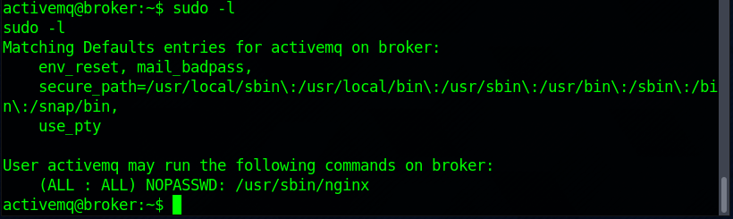
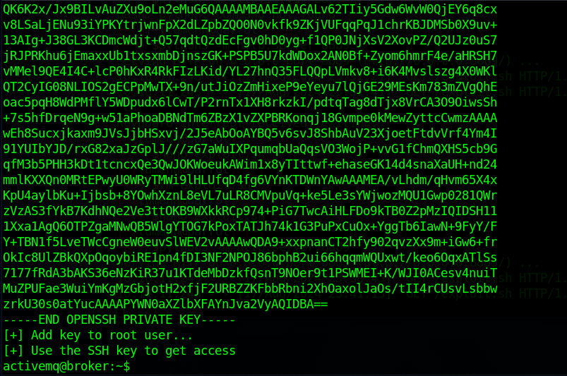
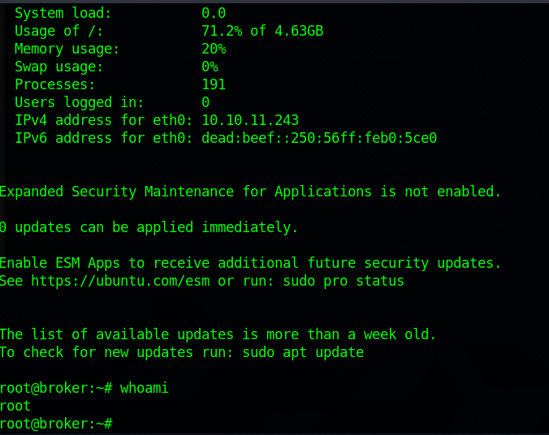

# Broker

#### _August 18th, 2024_

#### Difficulty: Easy

---
 
I started working on this machine by doing nmap scan, which revealed plenty of open ports. The server seems to be running activemq.
  

  
After the scan I traversed to http://broker.htb/ and was prompted with a sign in. I tried a few default credentials and was able to log in using admin:admin
  

  
  

  
The dashboard did not revealed much other than that activemq is running on version 5.15.5. After googling about activemq I ran across <a href="https://nvd.nist.gov/vuln/detail/CVE-2023-46604">CVE-2023-46604</a>, which is a RCE vulnerability. Bunch of PoCs for the vulnerability exist and I decided to give it a try, since 5.15.5 should be vulnerable to it.
  
I cloned a python based PoC from <a href="https://github.com/duck-sec/CVE-2023-46604-ActiveMQ-RCE-pseudoshell">here</a> and ran it, gaining a pseudoshell access. Then I started a nc listener to spawn a proper shell which I then upgraded to full TTY.
  

  
  

  
After gaining proper shell I grabbed the flag from /home/activemq. Then it was time to enumerate the machine. I found the source code for the web application in /opt/activemq and read through it, but did not find any useful credentials or hints. Running the sudo -l command however shows that I can run nginx as root:
  

  
This led me to google about any possibilities to use nginx for privesc. I found a really interesting implementation by <a href="https://gist.github.com/DylanGrl/ab497e2f01c7d672a80ab9561a903406">DylanGrl</a> that creates a nginx configuration file to set up a http server, run it as root and generate a ssh key to get access to root user. Running the exploit printed me the private key, which I copied to my host machine. Using the key, I was able to ssh to the target machine as root!
  

  
  

  