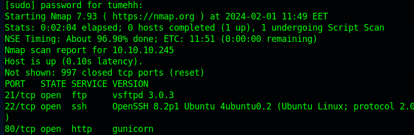
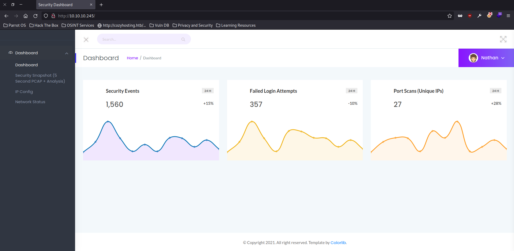
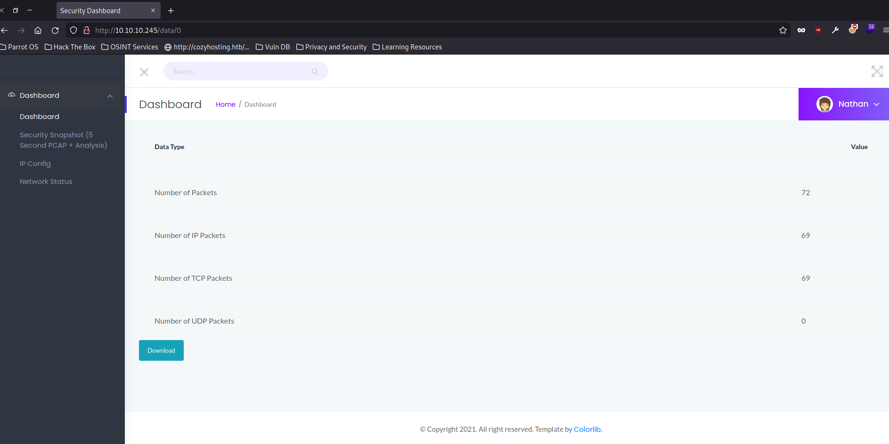
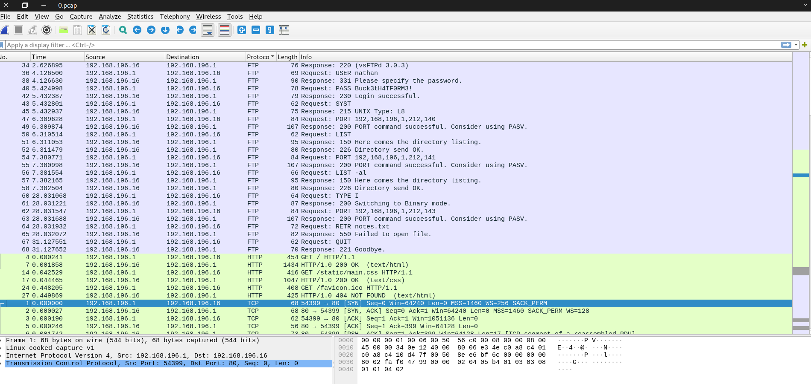
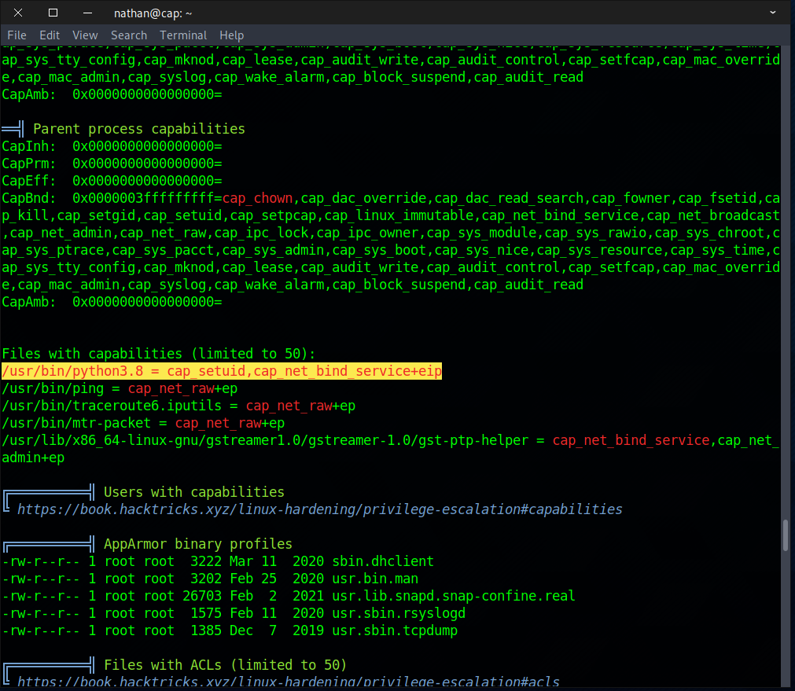
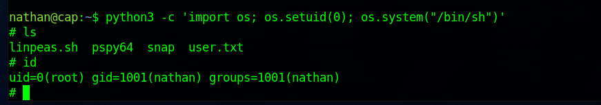

# Cap

#### _February 10th, 2024_

#### Difficulty: Easy


---
<br>

I started working on this machine with a quick nmap scan. The scan revealed 3 ports: ftp, ssh and http.



Opening the web browser at http://10.10.10.245/ was a "Security Dashboard". The dashboard shows some security event statistics including failed login attempts and port scans. 



On the navigation bar on left side of the web page there are netstat, ipconfig and "security snapshot" pages. Opening the "security snapshot" page I was presented with a page where I am able to download pcap files. The pcap file was however empty and therefore I was not able to do anything with it.

Looking at the URL i noticed that the index of the page is "/data/1". I changed the index to 0 and found another pcap file, with contents..



I opened the pcap file with wireshark and remembering that the machine has open ftp port, I ordered the packets by protocol and looked at the FTP packets. There, I found unencrypted FTP packets revealing username and password.



Using the username and password I was able to ssh into the target machine. The user flag was found in /home/nathan. 

On my host machine, I ran a python http.server and downloaded linpeas on the target machine. After running the script, I noticed that the script found 95% PE vector from python3.8:



Searching <a href="https://gtfobins.github.io/gtfobins/python/">GTFOBins</a> I found the following explanation: 

```If the binary has the Linux CAP_SETUID capability set or it is executed by another binary with the capability set, it can be used as a backdoor to maintain privileged access by manipulating its own process UID.```

Using this simple backdoor, I was able to gain root.

