# Codify

#### _August 24th, 2024_

#### Difficulty: Easy

---
 
I started working on this machine by doing nmap scan. Ports 22, 80 and 3000 are open.
  
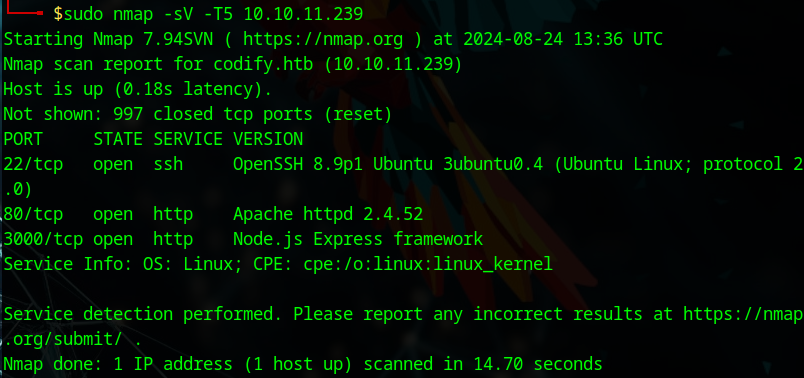
  
Next I traversed to the website at codify.htb. The website seems to be a nodejs sandbox, which allows you to experiment with Node.js code.
  
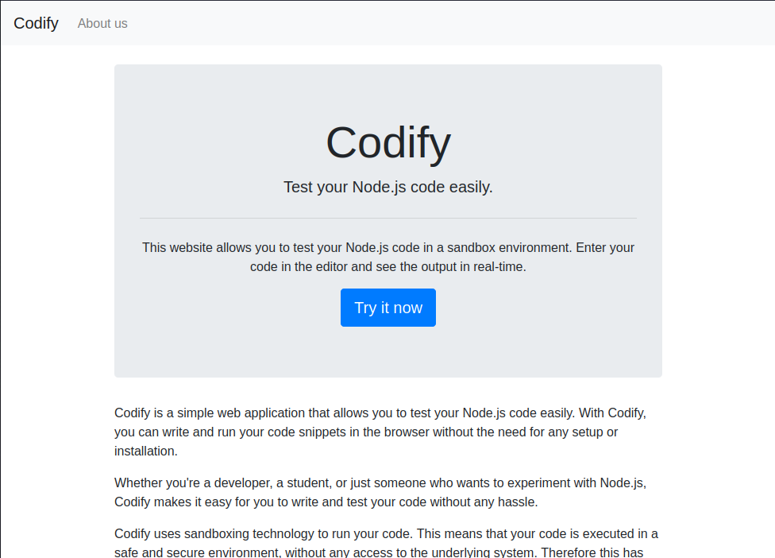
  
  
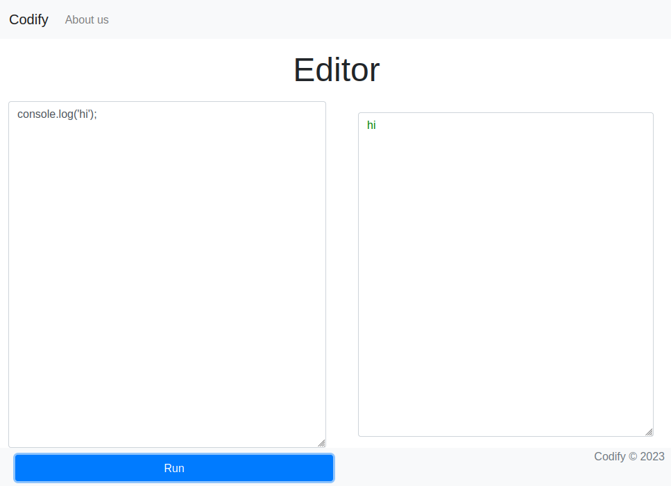
  
Description about the web app is found on the "about" page. The sandbox seems to be running on vm2 3.9.16.
  
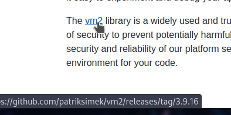
  
The next step was to google about this particular library. On top of the search bar I found <a href="https://nvd.nist.gov/vuln/detail/CVE-2023-30547">CVE-2023-30547</a>, which allows the attacker to raise an unsanitized host exception, which can be used to escape the sandbox. This seems like the exploit to follow.
  
Using the PoC found <a href="https://gist.github.com/leesh3288/381b230b04936dd4d74aaf90cc8bb244">here</a> with some modifications, I was able to create a reverse shell on my machine and gain a foothold as the user svc.
  
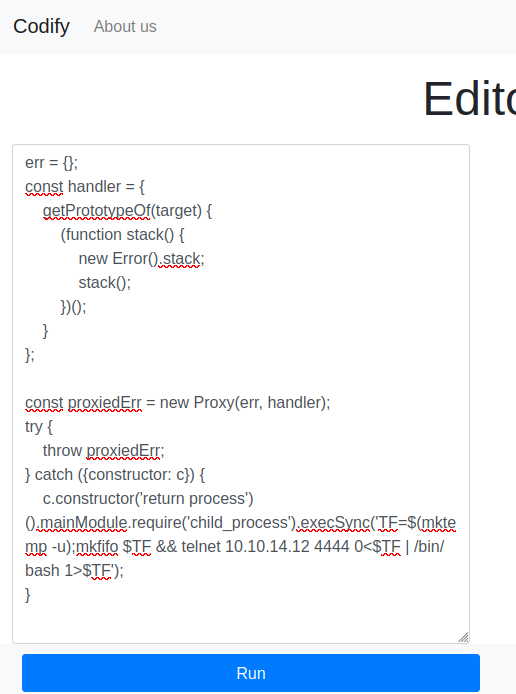
  
  
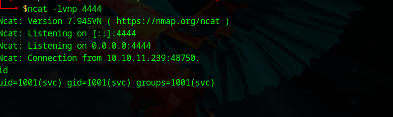
  
After gaining foothold it was time to enumerate the machine. I found an interesting directory in /var/www/ called contact. Inside this directory there is a file called "tickets.db". This file seems worth checking out. Reading the index.js file I found out that the database software used is sqlite3.
  
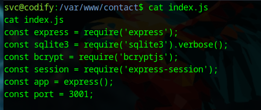
  
I fired up sqlite3 and started looking at the database. The database consists of two tables: users and tickets. 
  
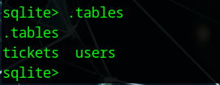
  
The users table has only 1 entry for user "joshua", which is also the user on the target machine. The table also has what looks like a hashed password. On the index.js above you can see that bcrypt is imported, and the hash components also correspond bcrypt. With this knowledge, I gave hashcat a try to crack the hash for the password. The crack attempt was successful:
  
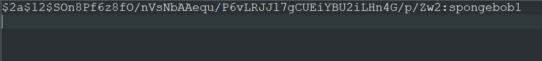
  
Using the cracked password I attempted to ssh into the machine as the user "joshua", and I was in!
  
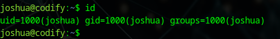
  
Next I spent quite a while enumerating the machine further and to find any clues. The only thing I found was that using 'sudo -l' it seems that user joshua is allowed to run a script called mysql-backup.sh as root. I figured this script must be the next step. When running the script the user is prompted to enter MySQL password for root. On failure, the script exits.
  
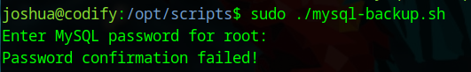
  
Reading the script, a few things caught my eye. First off, the database password for root is stored in /root.creds. when running the script, it is stored in DB_PASS variable. After confirming the password, the script runs MySQL using the credentials to fetch the database to make a backup of it. 
  
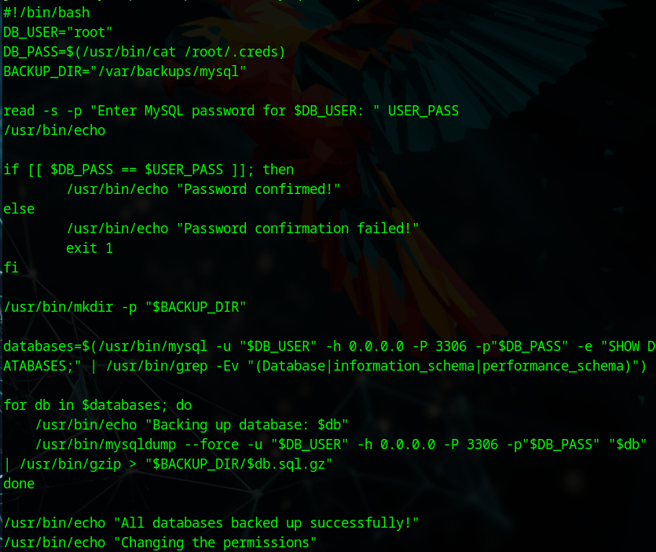
  
Almost immediately I noticed that there might be a way to bypass the password confirmation. Because of the usage of == isnide [[]], a pattern matching is performed rather than a string comparison. This means, by using a wildcard character such as * (which matches any string), the comparison will be succesful. Using this theory, I entered the character * as the root password, and the script ran succesfully.
  
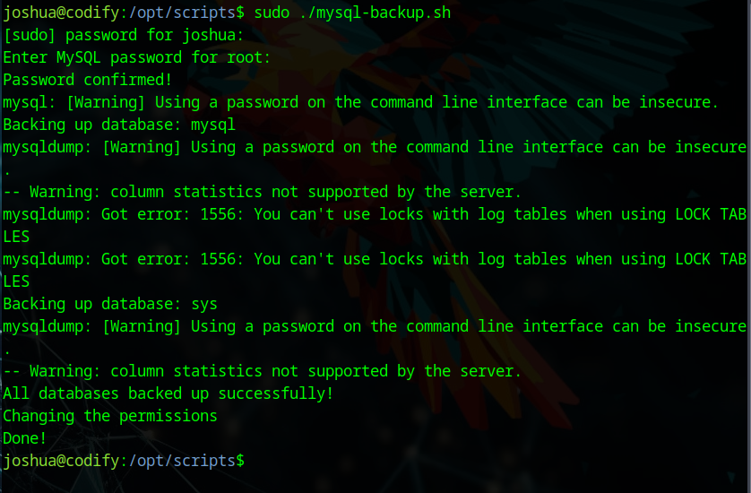
  
The next step was trivial. Knowing that the script uses the REAL password as an argument to fetch the database, simply by monitoring processes we should be able to capture the password. For this purpose, I used <a href="https://github.com/DominicBreuker/pspy/releases">pspy</a>. And just as I thought, I was able to capture the process with the root password in clear text. 
  
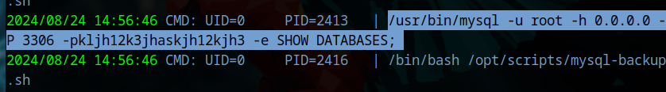
  
Using the password captured, I was able to change to root user. Machine owned!
  
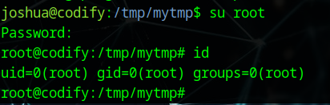
  