# Cozyhosting

#### _August 17th, 2024_

#### Difficulty: Easy

---
 
I started working on this machine by doing nmap scan. Ports 80, 5555 and 22 are open: 
  
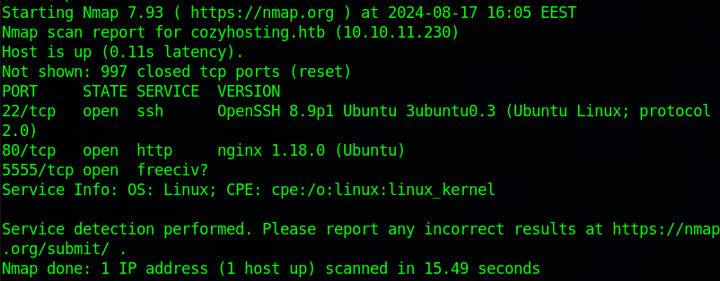
  
After the scan, I checked the web app running. The web application seems to be a cloud hosting service. Most of the buttons on the website don't work, except for the login button.
  
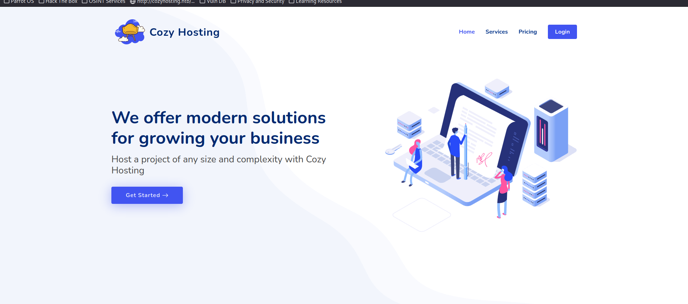
  
The login-button took me to a simple login page. I tried a few default credentials without success.
  
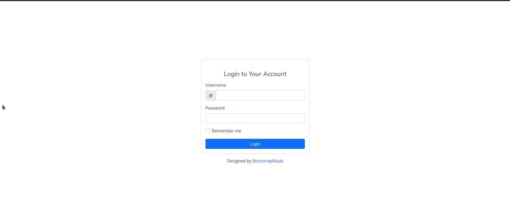
  
Next I decided to run a directory scan with gobuster to find any hidden directories that would help me forward. Gobuster managed to enumerate a few interesting directories:
  
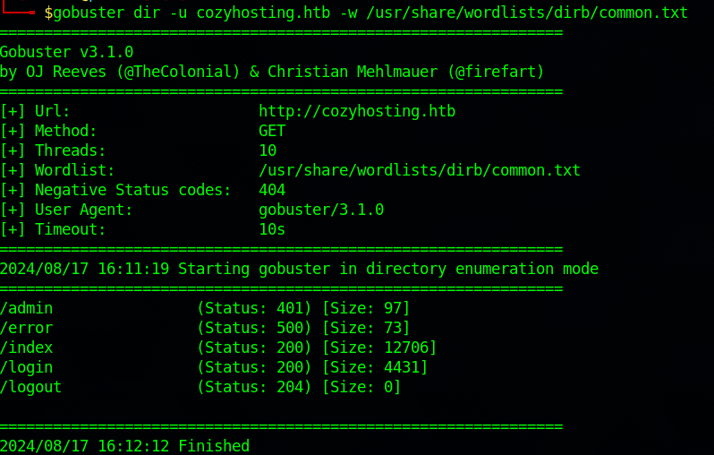
  
The admin page above redirects me back to the login page. The error page however was interesting and gave me a hint in moving forward. Copy-pasting the error message led me to forum discussions about Spring. Seems like the application is running on Spring.
  

  
After figuring this out I spent a while searching about possible Spring vulnerabilities. Something <a href="https://book.hacktricks.xyz/network-services-pentesting/pentesting-web/spring-actuators">HackTrickz</a> suggested was to check "Spring Actuators", endpoints which may be accessible if misconfigured. This indeed worked and I was able to access the endpoints. Most of them had no interesting information, except for "sessions", which revealed a session cookie that I possibly could exploit to access the admin page.
  
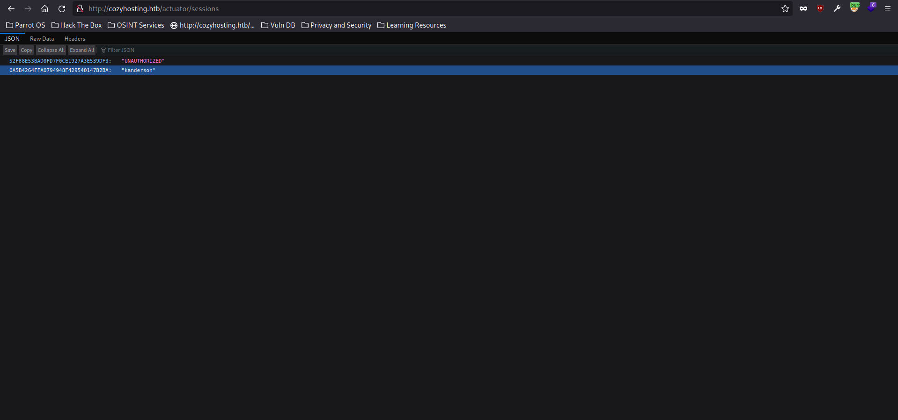
  
To use the session token I was able to access, I booted up burpsuite, and tried to access the admin page. In the request, I replaced the JSESSIONID cookie with the cookie I found and forwarded the request. I was succesfully in the dashboard as user 'kanderson'.
  
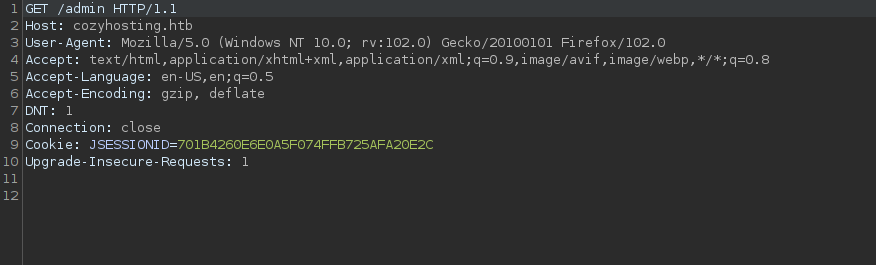
  
  
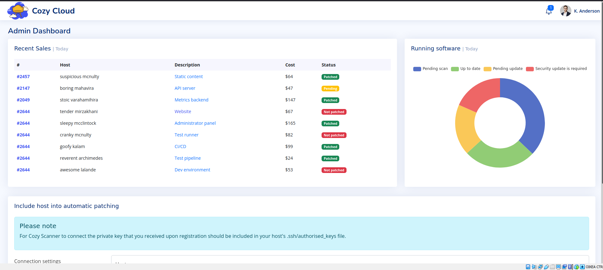
  
On the dashboard itself there is not too much to look at. On top of the page, different hosts supposedly running on the cloud are listed. On the bottom of the page however is a form, which can be used to connect to a host. The form uses two parameters: host and username.
  
I took a closer look at the request on burp. The name of the route used is /executessh. Playing with the parameter values I was able to create some error responses:
  
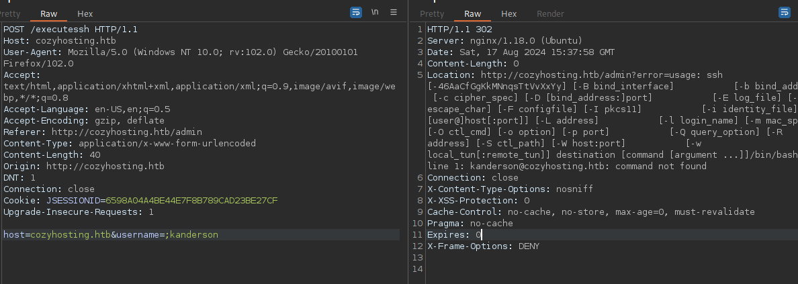
  
It seems that using the post request, a ssh command is run on the target machine. This hint led me trying to RCE and create shell on the target machine, which I managed to do with the payload below:
  
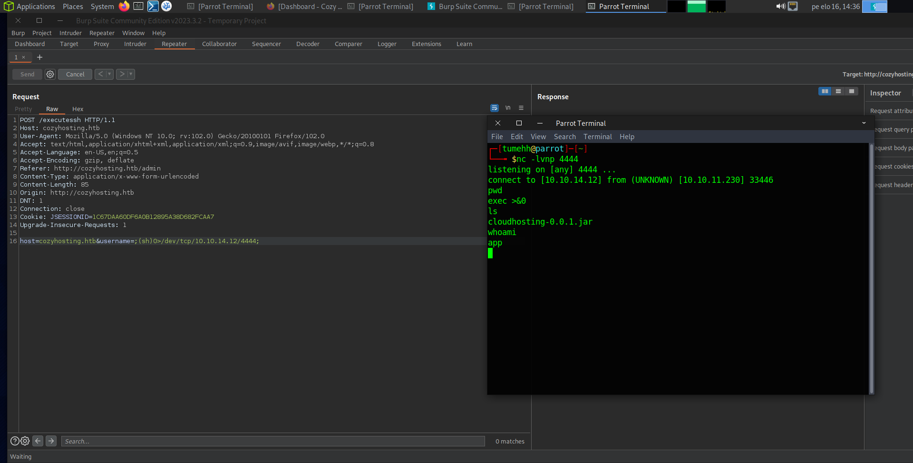
  
Now I had a foothold on the target machine as user 'app'. The next step was long and tedious enumeration of the target machine. Another user I found is 'josh'. After few deadends and scans I decided to check the .jar file in /app/ and read the source code of the application for any config files and credentials. I was able to find two pieces of credentials, for the fake user 'kanderson' and for postgresql. 
  
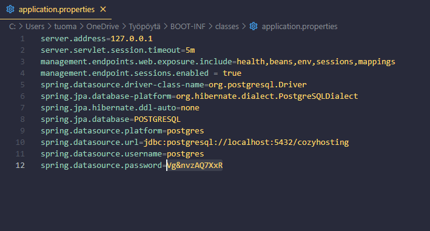
  
Using the postgresql credentials I was able to log on the postgresql server. 
  
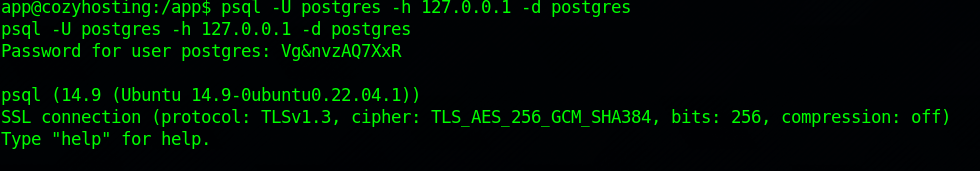
  
Inside, I found couple of empty databases and a database 'cozyhosting'. Inside cozyhosting, users 'kanderson' and 'admin' are listed, with their hashed passwords. 
  
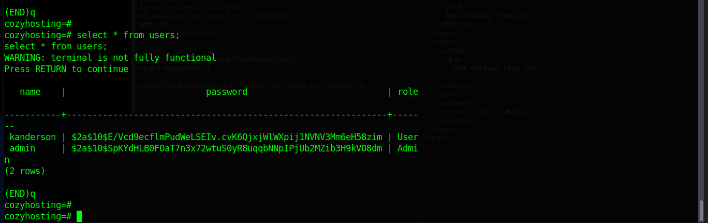
  
Knowing that kanderson is used as a 'fake user' for the initial foothold I didn't pay much attention to its hashed password. Instead I ran hashcat on the admin password. I knew that the hash is bcrypt because the hashing function was in the source files I read earlier. Bcrypt is also pretty easily recognizable when comparing to example hashes.
  
Using dictionary attack I was able to crack the hash very fast with rockyou-wordlist:
  
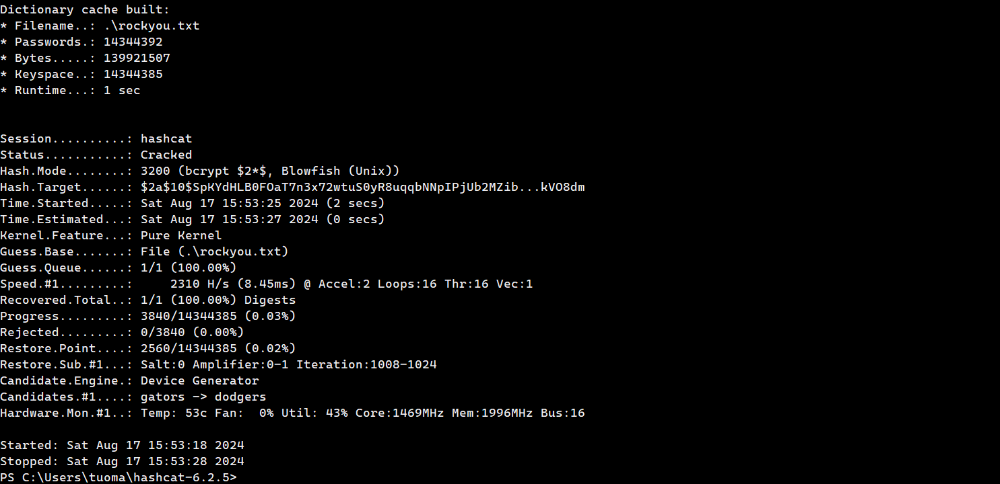
  
Using the cracked password I was able to ssh onto the target machine as 'josh'. The first thing I ran as 'josh' was sudo -l to check for any binaries I can run as root. I can run ssh as root.
  
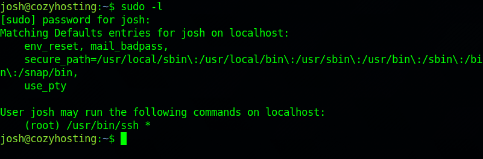
  
Next I checked <a href="https://gtfobins.github.io/">GTFOBins</a> for any ssh commands to maintain the privileged access. There is a command listed which I simply copy-pasted into the terminal and there we go. Machine rooted in two commands!
  
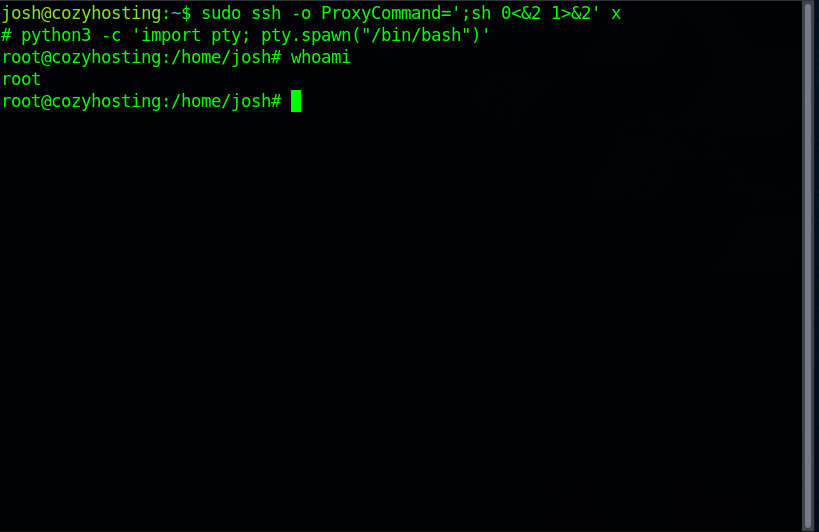
  