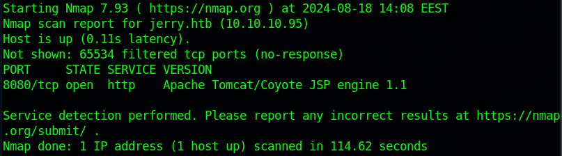
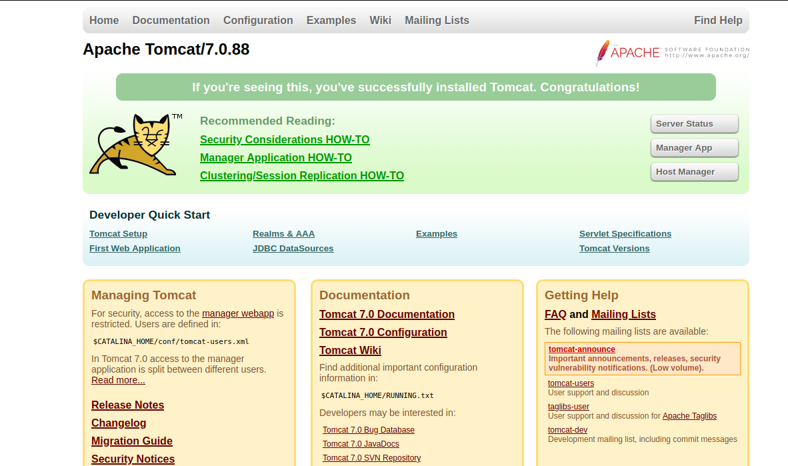
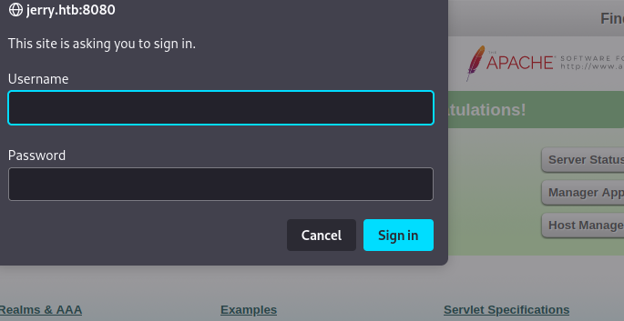
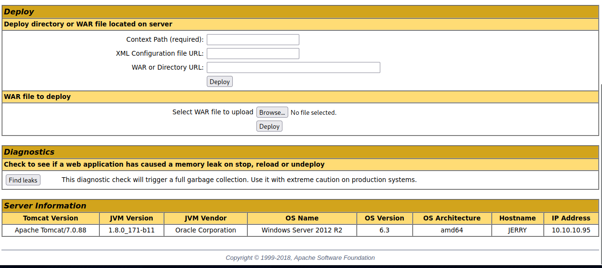
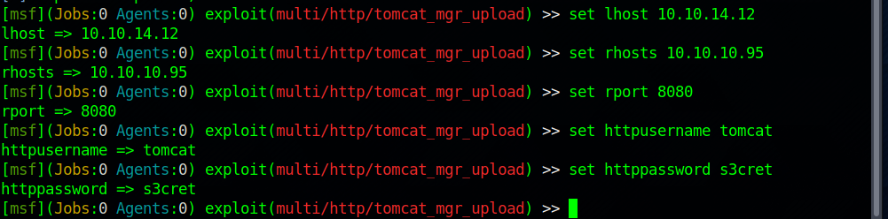
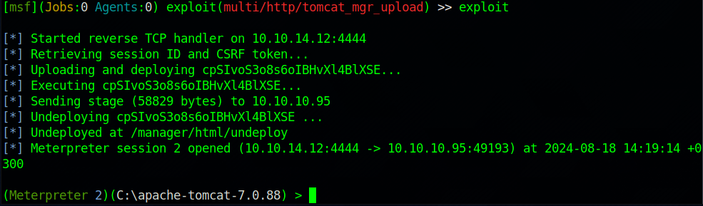
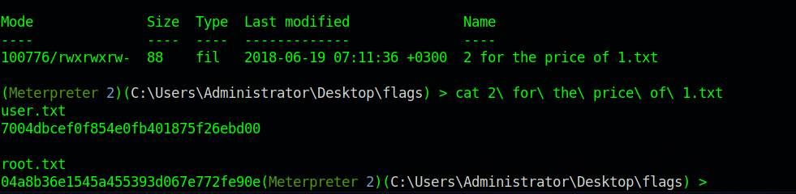

# Broker

#### _August 19h, 2024_

#### Difficulty: Easy

---
 
I started working on this machine by doing nmap scan, which revealed plenty open 8080 port. The server is running apache tomcat.
  

  
After the scan I traversed to http://jerry.htb:8080/ and I was on the apache tomcat default page. The page has a link to the host manager,
which requires a username and password.
  

  
  

  
I tried a bunch of default credentials used by Tomcat, and I was able to log in using the credentials tomcat:s3cret. On the application manager, a .war file can be deployed. According to <a href="https://book.hacktricks.xyz/network-services-pentesting/pentesting-web/tomcat">HackTrickz</a> this can be used to RCE.
  

  
HackTrickz recommends using Metasploit's tomcat_mgr_upload. I booted up msfconsole, chose the exploit and set it up.
  

  
After setting the options I ran the exploit and got access to the target machine. The flags were found at ../Users/Administrator/Desktop/flags/2 for the price of 1.txt
  

  
  

  