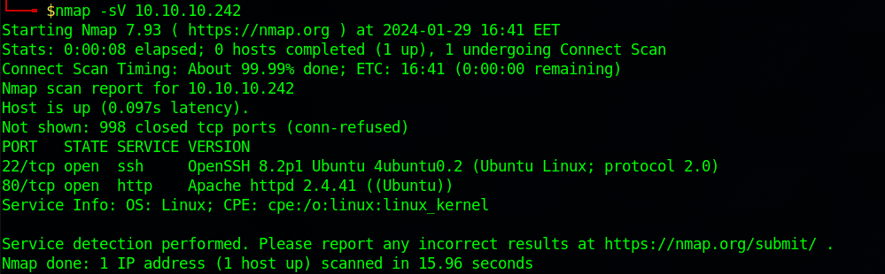
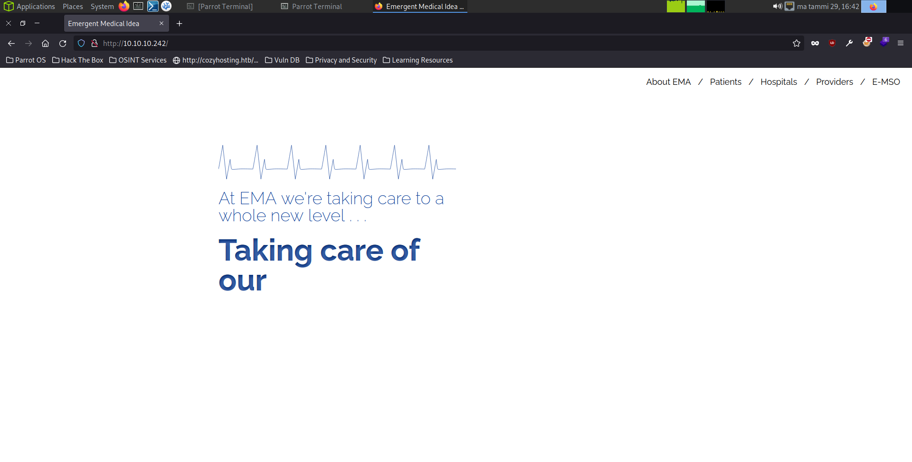
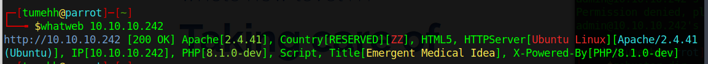
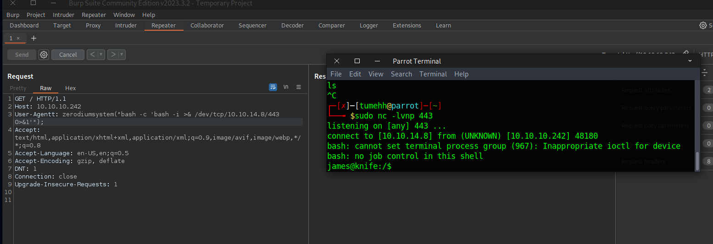
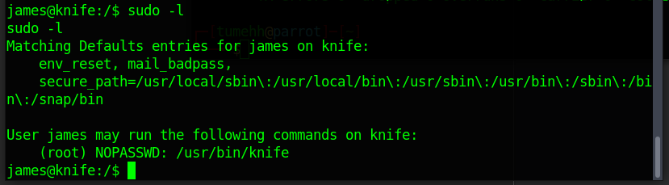
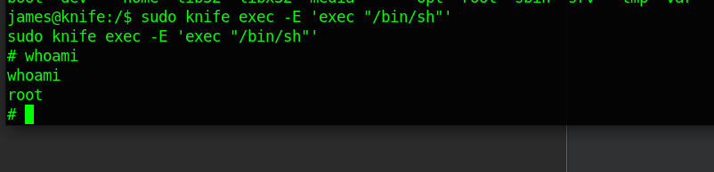

# Knife

#### _January 29th, 2024_

#### Difficulty: Easy


---
<br>

I started working on this machine by doing a quick nmap scan. The nmap scan revealed an open ssh-port and open http port. 



After the scan I opened my browser to check out the website. The website did not reveal anything interesting. 



The next step was to try some default ssh credentials, which did not work. I was not sure about the web technology at this point so I decided to run a whatweb scan. 



The scan revealed that the web server is using php8.1.0-dev. After a quick google search I found a RCE PoC <a href=https://www.exploit-db.com/exploits/49933>here</a>. Background info about this vulnerability can be found <a href="https://flast101.github.io/php-8.1.0-dev-backdoor-rce/">here</a>. However, the PoC did not give me full TTY access and therefore I used burp to craft a request to establish connection with netcat: 



After the connection I used
 ```
 python3 -c 'import pty; pty.spawn("/bin/bash")'
 ```
 To create proper shell.

 After this is it was time to take a look around. The user flag was found in /home/james. Next, I ran ```sudo -l``` to see if there are any commands "james" can run as root. 

 

 It revealed that james can run "knife" as root. I didn't know what knife is, so I had to do some research about it. Knife is a command-line tool that works as an interface between chef-repo and Chef Infra Server. 

At this point I started to google around to find if there is an easy way to escalate privilege using knife. I did end up finding something on <a href="https://gtfobins.github.io/gtfobins/knife/">GTFOBins</a>. It seems like if knife is allowed to run as sudo, the privileges are not dropped and this may be used to escalate. 

Following the guidance of GTFOBins, I ran the following command

``` sudo knife exec -E 'exec "/bin/sh" ```



The command seems to have worked and running ```whoami``` shows that I am now the root. Root.txt was found in /root/ directory. Machine pwned!