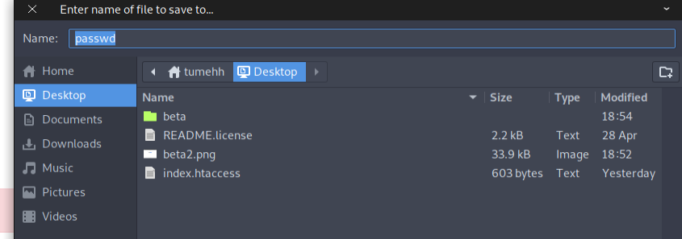
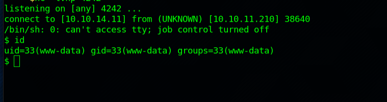
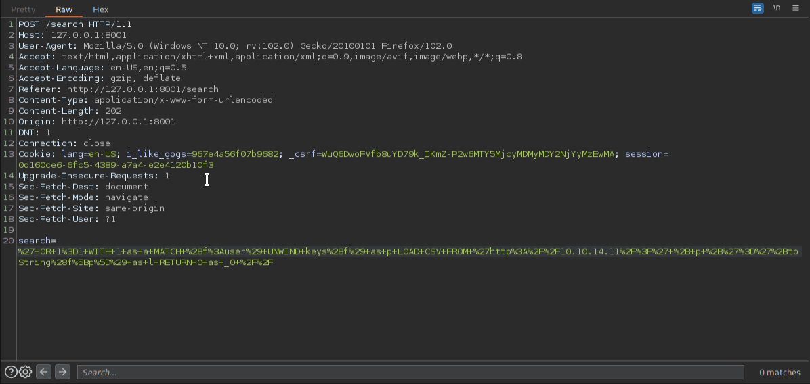

# OnlyForYou

#### _August 26th, 2023_

#### Difficulty: Medium

---
 
I started working on this machine by doing nmap scan on all ports. Ports 80 and 22 are open: 

The webapp running on the machine is a some kind of company page. I tried running gobuster on the domain, but nothing interesting was revealed. After looking around for a bit I found a text stating that the company has some beta products to test accompanied with a link to subdomain beta.only4you.htb. 

On the beta site the user is able to use two tools: image converter and resizer and also explore the tools' source code.

After reading the source code I noticed a possible vulnerability in app.py's /download route. on line 85 posixpath is used to grab the image file and send it to the user. If there is '..' or '../' in the file name the app renders 'Hacking detected': 

I thought I might be able to intercept the download request and change the path to something else bypassing the filter, like /etc/passwd. I gave it a try and it worked: 

I tried to find some interesting files like password files, flag files, credentials files without success. Then I thought that I might find something interesting in the webroot. From Burp responses I saw that the server is running on nginx, which means I should be able to find nginx configuration files and reveal the webroot path. After couple of attempts I was able to download a nginx config file at /etc/nginx/sites-enabled/default: 

Next, I looked for any interesting files in /var/www/only4you.htb/. Since I knew that the app is running on Flask like the 'beta' version, I was able to download "app.py" file. The file did not have anything too interesting but I noticed that it is importing a module named "form". This means there should be a file called "form.py". I gave it a try and I was able to download that one too.

In the "form.py" file I noticed quite interesting lines. The module is using shell(!!) run-command when digging the user's provided email address. This seemed like an obvious vulnerability: 

There is an regex in place to validate the input but after a while of googling and experimenting I was able to craft a payload and create a forward shell: 

After having access to the shell I started enumerating the target machine further. I did not manually find anything too interesting so I decided to download Linpeas from my attacker machine and ran it on the target machine. Linpeas discovered some active ports: 

It seems that there are some back-end applications running. I know that ports 7687 and 7474 run neo4j, so I figured ports 8001 and 3000 might be some internal web apps. To access these services I needed to setup reverse proxy using chisel. After booting chisel on the target machine and my machine the ports did indeed reveal two web interfaces. Port 3000 is running "Gogs", which seems to be some kind of self-hosted Git service. Port 8001 is running a web app with title "Only4you" and a login screen. Maybe this is some kind of admin interface for Only4you app? 

I tried some default credentials on both of the services above. I was able to login to the only4you app with default credentials admin:admin. After logging in a dashboard was loaded with some statistics. On the left panel is links to "employees" and "user profile": 

The "employees" tab has a functionality to search for employees. Playing with the search I was able to find a injection vulnerability: 

From the dashboard I also noticed a marked task saying that the database has been migrated to neo4j.

These hints led me to HackTricks, which explains cypher injection for neo4j. After some payload crafting I managed to output the database labels: 

One of the labels in the database is "user". Next I crafted a payload to get the keys of that label: 

It seems like I got some password hashes. John is a familiar user name, that account is also on the target machine. Maybe I should try cracking the hash and see if I can log onto 'john' user with that.

Before starting hashcat I checked a hash database to see if the hash is already cracked and available. I was able to find it so spending alot of time cracking wasn't necessary. I used the password to ssh on to the target machine and it was succesfull! 

Enumerating the machine I checked what commands the user john can run as sudo and got the following output: 

Googling about pip download I found something interesting. I should be able to create a malicious package to execute arbitrary code and so escalate privileges. I followed the steps on the guide, creating a package and then building it on my host machine and moved it to the attacker machine.

After that I logged into Gogs, created a new repository and uploaded the malicious package: 

Then I simply downloaded it as sudo to the target machine. This exploit causes the specified arbitrary code in setup.py to execute. When the download finished, I ran "bash -p" to open bash shell. After that I ran the command "whoami". I am root. Machine pwned!

