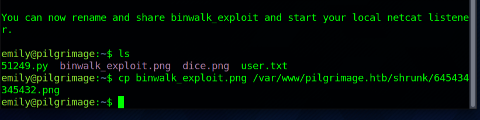

# Pilgrimage

#### _December 28th, 2023_

#### Difficulty: Easy

---
 
I started this box by doing a quick nmap scan. The scan revealed a /.git repository, which I was however unable to access. After that I did some enumeration with gobuster, which didn't show anything too much interesting except for the .git directory.

Looking at the website itself we have an application that you can register, login on and upload images to shrink their size. At this point I tried the usual manual file upload tricks, trying to inject malicious code in image disguise. This was however a deadend. I also noted that you can render user input on the webpage using the 'message' parameter. After playing around with it without success I decided to take another look at the .git directory. 

Using gitdumper I was able able to dump the git repository to my local machine. Looking around the source files took a while and alot of googling, but finally I came acrross a file named "magick" which is used in index.php. After gathering information about "magick" I found CVE-2022-44268.

For the vulnerability I found a PoC script here. Using the script I was able to poison a .png file and upload it to the website! The exploit seems to work and using the script again to read the information from the poisoned image, I was able to find user named "emily" in /etc/passwd.

Knowing only the username however is not enough to gain user access. At this point I tried some default credentials without any luck. Then I decided to take a step back and look at the source code again for any hints. Looking for credentials I figured login.php would be the file I should investigate to understand the authentication process of the application. In the file i found a line, where a sqlite database is created and queried at /var/db/pilgrimage. 

To access the database I realized I can use the same script file as before to omit the database. At this point I got the following error: UnicodeDecodeError: utf-8' codec can't decode byte 0x91 in position 99: invalid start byte. Taking a look at the script code I noticed a line of decoding, which I commented out and changed the print function to print the raw data. Running the script again without decoding I got the following output, which looks like something we might be able to work with. 

What I knew at this point is that there is an user called emily and I have hold of the database file, which looks like encrypted in Hex. Thinking about ways to decipher the long hexstring, I decided to give CyberChef a try, which worked immediately. In the output I noticed couple of interesting strings: "coucoutest" and "-emilyabigchonkyboi123". 

After many failed attempts to login on user emily I realized that what I have might be user:pass format, meaning that "emily" is the user and "abigchonkyboi123" is the password. And it worked. I had now the user access. 

After grabbing and submitting the user flag it was time to start working towards root access. First step I took was to wget linpeas.sh from my host machine. After that I gave the file chmod +x and ran the script. Linpeas showed alot of information as always, and I spent quite long checking the versions of different services like Sudo and other files noted in the report. Nothing really interesting there.

After that, I decided to run ps aux and list all running processes and see if I would find anything vulnerable there. Firstly I noticed php-fpm 7.4 running, which led me to CVE-2021-21703. This was however a deadend. Next I noticed a script called malwarescan.sh running at /usr/sbin/malwarescan.sh. 

Looking at the sourcecode of the script i noted a line binout="$(/usr/local/bin/binwalk -e "$filename"). Not sure what the binwalk file is, i decided to take a look at it. The file is a python script and the code isn't available. Running the file on the other hand omits information about it. The version is 2.3.2. 

Googling Binwalk 2.3.2 reveals CVE-2022-4510, which is a RCE vulnerability. Exploit PoC is available here. The exploit requires target IP, port and an .png file.

At first, I used the exploit the wrong way and then realized i need to first download the exploit script and .png image to /home/emily, then run the exploit as emily. Using port 4567 I started netcat listener on my host machine and after that moved the exploited .png file to /var/www/pilgrimage.htb/shrunk. 

As you can see this is similar exploit as when getting the foothold. Looking back at the host terminal, we were connected to 10.10.11.219. using 'id' command we see that we are now the root. 

